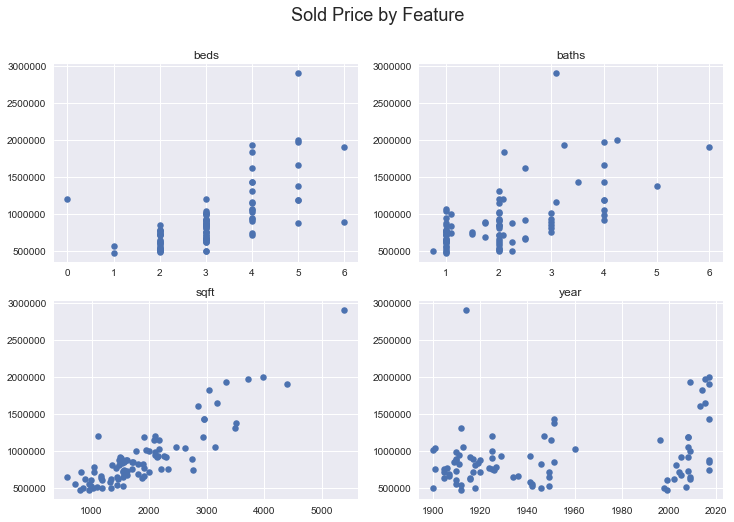

---
#### Scraping for data, preliminary analysis  
___

I scraped for data for the first time to run some preliminary analyses and had a taste of the process from start to (ever so imperfect) finish. Even though this analysis of data scraped from [Zillow](https://zillow.com) is _very_ raw, I am excited about what I was able to do: scrape data from a website using Beautifulsoup, convert data to a pandas dataframe, save it as a csv file, and run a few linear regressions using scikit-learn. As I scraped for data myself, I only pulled out a few features from the html tags (please Zillow, don't sue me). If I was to move forward with this analysis, I would definitely use their API instead to gather additional features.

I wanted to predict housing prices in Seattle, WA, specifically zip code 98103. I could have collected more data points had I included additional zip codes and used one-hot encoding...but starting small and expanding later is always an option! 

My code and a readme is up on [github](https://github.com/sfung11/Predicting-Home-Prices.git), so I wanted to share a few interesting graphs here.

By using all the features (number of bedrooms, bathrooms, the sqft, and year built) I was able to get an R-squared value of 0.76 on my test set.

Looking at each feature separately, all had a positive correlation, with sqft being the strongest. In the next iteration, I will treat year-built differently, they seem to cluster into 3 different groups.

 
I was curious about sqft, that perhaps there is a point where sold price converges if the size of the house converges (we're constrained by our geography!), but I didn't think about the ability to build up, so perhaps price per sqft would serve as a better feature. I also did not account for lot size. Based on the year a house was built, I could either bin the years or add on a corresponding house/architecture style (craftsman, modern, cape code, etc) and handle that and any other categorical features using one-hot encoding.

All in all, I learned a bit about gathering data and how much preprocessing needs to be done before it's ready to be analyzed. I'm looking forward to building on what I've done so far.  
